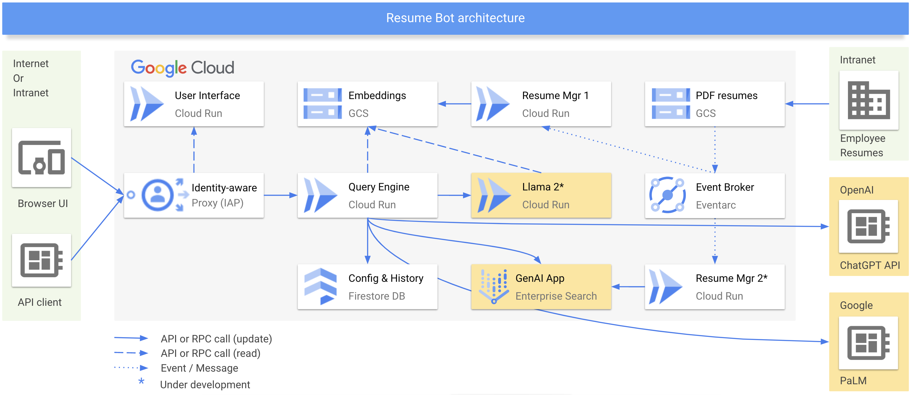

<!-- Copyright 2023 Qarik Group, LLC
Licensed under the Apache License, Version 2.0 (the "License");
you may not use this file except in compliance with the License.
You may obtain a copy of the License at
    http://www.apache.org/licenses/LICENSE-2.0
Unless required by applicable law or agreed to in writing, software
distributed under the License is distributed on an "AS IS" BASIS,
WITHOUT WARRANTIES OR CONDITIONS OF ANY KIND, either express or implied.
See the License for the specific language governing permissions and
limitations under the License. -->

<!-- LLM part is based on: https://gpt-index.readthedocs.io/en/stable/guides/tutorials.html -->

# Resume Chatbot

This project allows users to interact with people resumes stored in PDF files and ask questions about a single resume or
a group of people in plain English. Example questions:

- What are the main skills for [person name]?
- Does [person name] have Java skills?
- Compare and contrast the skills of [person name1] and [person name2].
- List all people with Java skills.
- Do any people have Google Cloud and AWS skills?
- When did [person name] start working for Qarik?
- What is the most common skill among all people?
- Tell me about [person name] strengths and weaknesses?
- Among all people, who has the most experience with Java, Google Cloud, and Kubernetes?
- How many people have skills in Python and Machine Learning?
- Where did [person name] work the longest?

Here is an example of the UI:


Note that in the current implementation queries across multiple resumes often fail. This bug is a work in progress. If
you found a bug, or have any ideas on how to improve this tool, please
[open an issue](https://github.com/Qarik-Group/resume-chatbot/issues), or better yet - submit a pull request.

## Prerequisites

In order to build and deploy this project you need the following:

- Google Cloud project
- Ability to create external IP addresses in your GCP project (only if you decide to use IAP in front of Cloud Run)
- ChatGPT API key

## Setup

- Create a Google Cloud Platform (GCP) project: https://console.cloud.google.com/projectcreate

- Clone the repo

  ```bash
  PROJECT_HOME=~/resume-chatbot
  git clone git@github.com:Qarik-Group/resume-chatbot.git "${PROJECT_HOME}"
  ```

- Copy template environment files:

  ```bash
  cp "${PROJECT_HOME}/.env.example" "${PROJECT_HOME}/.env"
  cp "${PROJECT_HOME}/components/server/.env.example" "${PROJECT_HOME}/components/server/.env"
  cp "${PROJECT_HOME}/components/client/.env.example" "${PROJECT_HOME}/components/client/.env"
  ```

- Get your [OpenAI API Key](https://platform.openai.com/account/api-keys) and save it in the
  [components/server/.env](components/server/.env) file.

- Update all three '.env' files created above with your own values, including the OpenAI API key. Also check the
  ENABLE_IAP setting and set it to "true" if you want to enable IAP in front of your Cloud Run instances. However be
  aware that the initial setup will take more than an hour because it takes that long to propagate the SSL certificate
  settings.

- Add pdf files with resumes to the [components/server/data](components/server/data/) folder. Files shall be named using
  'Firstname Lastname.pdf' format with space separating first and last name. Optionally you can append 'Resume' after
  last name. For example: 'Roman Kharkovski Resume.pdf'. You can place any number of pdf files into the data folder.

- Optional: If you decide to use IAP in front of Cloud Run, make sure your GCP Org policy allows external IP addresses.

- Run setup.sh script.

- Build and deploy the server to Cloud Run:

  ```bash
  cd components/server/dev
  ./deploy.sh
  ```

- If you are using IAP, get the external IP address 'skillsbot-backend-ip' for Backend service:

  ```bash
  gcloud compute addresses list
  ```

  Otherwise simply copy the URL for the backend Cloud Run instance:

  ```bash
  gcloud run services list
  ```

- Update the [app.js](components/client/src/App.js) with the proper backend IP (skillsbot-backend-ip) or URL of your
  Cloud Run service if you are not using IAP, for example:

  ```javascript
  const serverBackendUrl = "https://11.22.33.444.nip.io"; // If you are using IAP;
  const serverBackendUrl = "https://skillsbot-backend-l3gt8712uh-uc.a.run.app"; // If you are not using IAP;
  ```

- Build and deploy the UI to Cloud Run:

  ```bash
  cd components/client/dev
  ./deploy.sh
  ```

- If you decided to use IAP:

  - Steps above create Self Signed Certificate and may take up to 1 hour to complete. Feel free to re-run the scripts.

  - Open [IAP GCP Console](https://cloud.google.com/iap/docs/customizing#allowing_http_options_cors_preflight) and
    enable "HTTP Preflight" for CORS.

  - Get the external IP address 'skillsbot-ui-ip' for UI service:

    ```bash
    gcloud compute addresses list
    ```

- If you are not using IAP, copy the URL for the UI service:

  ```bash
  gcloud run services list
  ```

- In GCP Console create the OAuth Consent Screen (here is a
  [good article](https://blog.logrocket.com/guide-adding-google-login-react-app/) that describes some of these
  concepts):

  - Make it internal application
  - Use Authorized domain: URI of your UI Cloud Run Service without the 'https://' part, and if you are using the IAP,
    also add use '<UI_IP_ADDRESS>.nip.io'
  - Add scopes: './auth/userinfo.email' and './auth/userinfo.profile'

  These changes may take from few minutes to hours to propagate, but the good news you only need to do it once.

- Open the chatbot web page using url [https://<UI_IP_ADDRESS>.nip.io] (if you are using IAP, or use direct Cloud Run
  URL if you are not) and interact with the bot. Qarik employees can use this frontend: [go/skills-bot](go/skills-bot).

## Test queries locally

The experimentation with the queries is best done on a local machine, which can be your physical machine, or a cloud
based environment. To run the server and tests locally follow the steps below:

- Follow the "setup" section above up to and including "./setup.sh" script (frankly some of the setup wont be needed for
  development, so feel free to comment it out as you see fit).

- In your terminal run the local instance of the server:

  ```bash
  cd "${PROJECT_HOME}"
  source .venv/bin/activate
  cd components/server/dev
  ./run_local.sh
  ```

- In another terminal run the local instance of the test:

  ```bash
  cd "${PROJECT_HOME}"
  source .venv/bin/activate
  cd components/server/dev
  ./test.sh
  ```


## Development

The development is best done on a local machine, which can be your physical machine, or a cloud based environment. You
can run the server as the local Python process (or as a local container), and run UI in a local NodeJS process (or a
local container):

- Follow the "setup" section above up to and including "./setup.sh" script (frankly some of the setup wont be needed for
  development, so feel free to comment it out as you see fit).

- In your terminal run the local instance of the server:

  ```bash
  cd "${PROJECT_HOME}"
  source .venv/bin/activate
  cd components/server/dev
  ./run_local.sh
  ```

- In another terminal run the local instance of the client:

  ```bash
  cd "${PROJECT_HOME}"
  cd components/client/dev
  ./run_local.sh
  ```

- Once you open the local client UI in your browser, navigate to the "Settings" menu option and update the "Backend URL"
  to point to your local server: "http://127.0.0.1:8000".

## Architecture

This application can be deployed in two modes (controlled by the "ENABLE_IAP" flag in the root '.env' file):

1. Simple - without using IAP, allowing users to connect directly to Cloud Run services.

2. Advanced - with IAP to protect access to the frontend and backend Cloud Run services.



Note: Currently PDF files with resumes are statically stored locally in the [data](./components/server/data) directory
of the backend container, but in the future will be loaded and dynamically updated via GCS.
